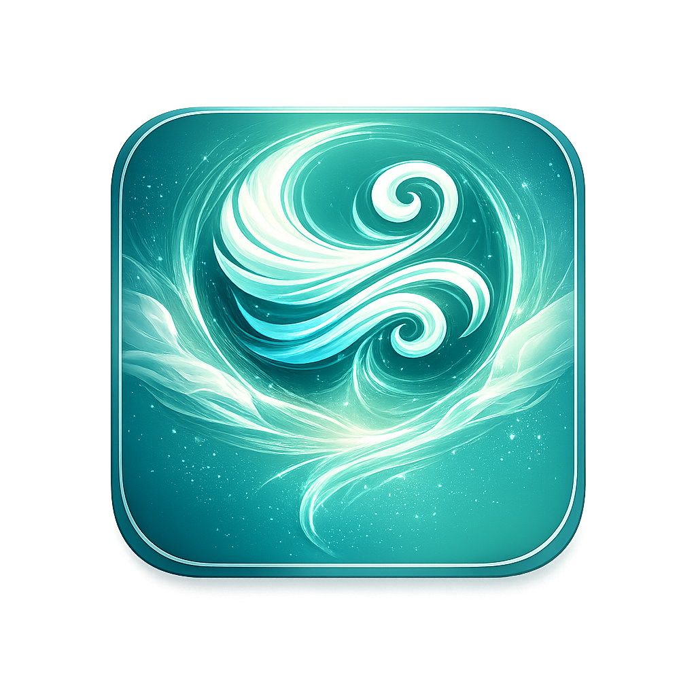

# Vayu

Vayu is a free modular audio effect rack built with JUCE. It combines a five-band EQ, analyzer, reorderable effect chain, rack presets, effect presets, standalone playback, and a polished custom interface into one lightweight tool for shaping sound fast.

This project is part of a broader trilogy:

- `Vayu`: audio changer, rack, and sculptor
- `Indra`: future synthesizer
- `Agni`: future MIDI transformer and sequencer

## Highlights

- Five-band EQ with draggable curve nodes
- Live spectrum analyzer overlay
- Eight reorderable effect modules
- Distortion
- Chorus
- Flanger
- Phaser
- Delay
- Stereo width / imaging
- Reverb
- Compressor with multiple styles and sidechain-ready routing
- Factory EQ presets
- Factory rack presets
- User rack preset save/load/delete
- User effect preset save/load
- Undo and redo support
- Standalone app build
- AU and VST3 project support on macOS

## Effect Rack

Vayu processes audio in a modular serial chain. You can drag effect modules in the rack to change processing order and save that order into rack presets and session state.

Current modules:

1. Distortion
2. Chorus
3. Flanger
4. Phaser
5. Delay
6. Stereo
7. Reverb
8. Compressor

## Compressor Modes

The compressor is designed as a style-based utility rather than a single static model.

- `Clean`: transparent dynamics control
- `Glue`: bus-style smoothing
- `Punch`: more forward transient energy
- `Pump`: sidechain-style movement for rhythmic compression

The processor also supports an optional external sidechain input bus when the host exposes one.

## Presets

Vayu supports three preset layers:

- Built-in EQ presets
- Built-in rack presets
- User rack and effect presets stored locally

On macOS, user rack presets are currently stored in:

`~/Library/Vayu/Presets/Rack`

User effect presets are stored in:

`~/Library/Vayu/Presets/Effects`

## Formats

The current project is set up for:

- Standalone app
- AU on macOS
- VST3

VST2 is not included.

## Download And Install

### macOS

If you download a release build from GitHub, you will typically see one or more of these:

- `Vayu.app`
- `AudioEQ.component` or `Vayu.component`
- `AudioEQ.vst3` or `Vayu.vst3`

Install locations:

- Standalone app:
  Move `Vayu.app` into `/Applications` or anywhere you prefer.
- AU:
  Copy the `.component` bundle to `~/Library/Audio/Plug-Ins/Components` for a single-user install, or `/Library/Audio/Plug-Ins/Components` for all users.
- VST3:
  Copy the `.vst3` bundle to `~/Library/Audio/Plug-Ins/VST3` for a single-user install, or `/Library/Audio/Plug-Ins/VST3` for all users.

After installing AU or VST3, rescan plugins in your DAW.

### Windows

Windows does not support AU. Use VST3.

Common release files:

- `Vayu.vst3`
- `Vayu.exe` for standalone, if provided in a Windows release

Install locations:

- VST3:
  `C:\Program Files\Common Files\VST3`
- Standalone:
  Place the app wherever you want, or use an installer if one is included in the release.

After copying the plugin, rescan plugins in your DAW.

### Linux

Linux does not support AU. If Linux binaries are provided in a release, use the VST3 build.

Common VST3 locations:

- `~/.vst3`
- `/usr/lib/vst3`
- `/usr/local/lib/vst3`

If no Linux binaries are attached to a release yet, build from source using JUCE and your preferred Linux toolchain.

## Building From Source

### Requirements

- JUCE 8
- Xcode 15+ on macOS for the included Xcode exporter
- A C++17-capable compiler

### macOS Build

1. Open [AudioEQ.jucer](AudioEQ.jucer) in Projucer if you want to regenerate project files.
2. Open [AudioEQ.xcodeproj](Builds/MacOSX/AudioEQ.xcodeproj) in Xcode.
3. Choose one of these schemes:
   - `AudioEQ - Standalone Plugin`
   - `AudioEQ - AU`
   - `AudioEQ - VST3`
4. Build and run.

The standalone target is the fastest way to sanity-check audio flow, UI behavior, presets, and rack ordering before testing in a DAW.

### Notes

- This repo currently contains JUCE-generated project files for macOS.
- If you regenerate the project in Projucer, make sure your JUCE module paths are valid on your machine.
- The checked-in Xcode exporter is the easiest path for macOS users today.

## Current Feature Set

- Professional-style, custom visual design with a Vayu-specific mint/cyan identity
- Real-time meters for input and output
- Rack order persistence
- Rack preset deletion directly in the UI
- Standalone app icon support
- Tail reporting for time-based effects
- Safer mono/stereo routing behavior
- Undo and redo integration for parameter changes

## Recommended First Test Pass

1. Launch the standalone app.
2. Confirm your input and output devices in the app audio settings.
3. Verify signal hits the input and output meters.
4. Load factory presets and confirm the EQ and effect chain respond.
5. Reorder effects and confirm the sound changes.
6. Save, load, and delete a user rack preset.
7. Then test AU and VST3 in your DAW.

## GitHub Release Suggestions

For the first public release, include:

- A zipped macOS standalone app
- A zipped AU build
- A zipped VST3 build
- Basic release notes
- A short install guide that links back to this README

Good first tag ideas:

- `v1.0.0`
- `v1.0.0-beta1` if you want Ableton testing first

## Known Gaps

- Ableton validation is still recommended before the first public tag
- Windows and Linux release artifacts are not built in this repo yet
- Code signing and notarization are not complete yet for macOS distribution

## Vision

Vayu is meant to be a free, high-quality tool that helps newer producers and developers get started without compromising on feel, workflow, or sound design potential. If you use it, build on it, or improve it, that is exactly the point.
